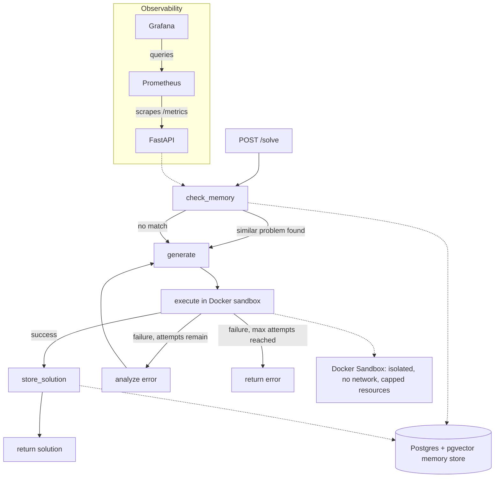

\# Self-Healing Code Agent


An AI agent that generates code, executes it in an isolated sandbox, diagnoses failures, and retries — with persistent memory so it never solves the same problem twice.


\## How it works


1\. \*\*Check memory\*\* — searches a pgvector-backed store for a similar problem solved before

2\. \*\*Generate\*\* — calls an LLM (Gemini) to write code, using memory context if available

3\. \*\*Execute\*\* — runs the generated code inside a disposable, network-isolated Docker container

4\. \*\*Analyze\*\* — if execution fails, diagnoses the error and feeds it back into the next generation attempt

5\. \*\*Retry\*\* — loops back to generation with the diagnosis, up to a configurable max attempts

6\. \*\*Store\*\* — on success, saves the problem/solution pair to memory for future reuse


Orchestrated with \*\*LangGraph\*\* as a stateful graph: `check\_memory → generate → execute → (analyze → generate | store)`.


## Architecture Diagram




\## Architecture


\- \*\*API\*\* — FastAPI service exposing `POST /solve`

\- \*\*Sandbox\*\* — Docker-in-Docker execution engine; no network access, capped CPU/memory, hard timeout

\- \*\*Memory\*\* — Postgres + pgvector for semantic similarity search over past solutions

\- \*\*Observability\*\* — Prometheus metrics (latency, retries, memory hit rate, sandbox execution time/failures) visualized in Grafana

\- \*\*CI/CD\*\* — GitHub Actions runs the test suite and builds the Docker image on every push


\## Tech stack


\- Python, FastAPI, LangGraph

\- PostgreSQL + pgvector

\- Docker (sandboxed execution)

\- Prometheus + Grafana

\- GitHub Actions

\- Kubernetes manifests for local deployment (minikube)


\## Running locally (Docker Compose)


```bash

docker compose up --build

```


\- API: `http://localhost:8000` (docs at `/docs`)

\- Prometheus: `http://localhost:9090`

\- Grafana: `http://localhost:3000` (default login `admin`/`admin`)


\## Running on Kubernetes (minikube)


```bash

minikube start

minikube docker-env | Invoke-Expression   # PowerShell

docker build -t self\_healing\_agent-api:latest .


kubectl apply -f k8s/

kubectl get pods -n self-healing-agent

```


Access services via:

```bash

minikube service api -n self-healing-agent --url

minikube service grafana -n self-healing-agent --url

minikube service prometheus -n self-healing-agent --url

```


\## API


\*\*POST `/solve`\*\*

```json

{ "problem": "write a function that reverses a string" }

```


Returns generated code, explanation, number of iterations, error history, and whether the solution came from memory.


\## Environment variables


| Variable | Description |

|---|---|

| `DATABASE\_URL` | Postgres connection string |

| `GEMINI\_API\_KEY` | API key for code generation |


\## Testing


```bash

python test\_memory.py

python test\_sandbox.py

```


\## Notes


\- Sandbox execution uses a mounted Docker socket for local/learning purposes. This grants host-level Docker access and is \*\*not safe for production\*\* — a real deployment should use a Kubernetes-native sandboxing approach (e.g. spawning Jobs via the Kubernetes API) instead.

\- Redis and Horizontal Pod Autoscaling were considered and deliberately excluded — no caching/session need and no real traffic pattern to justify autoscaling yet.

